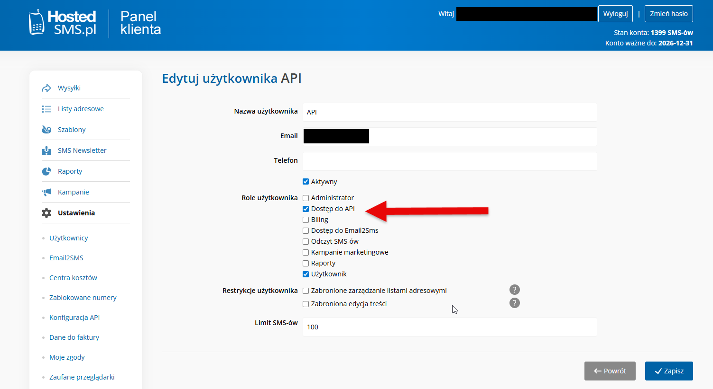
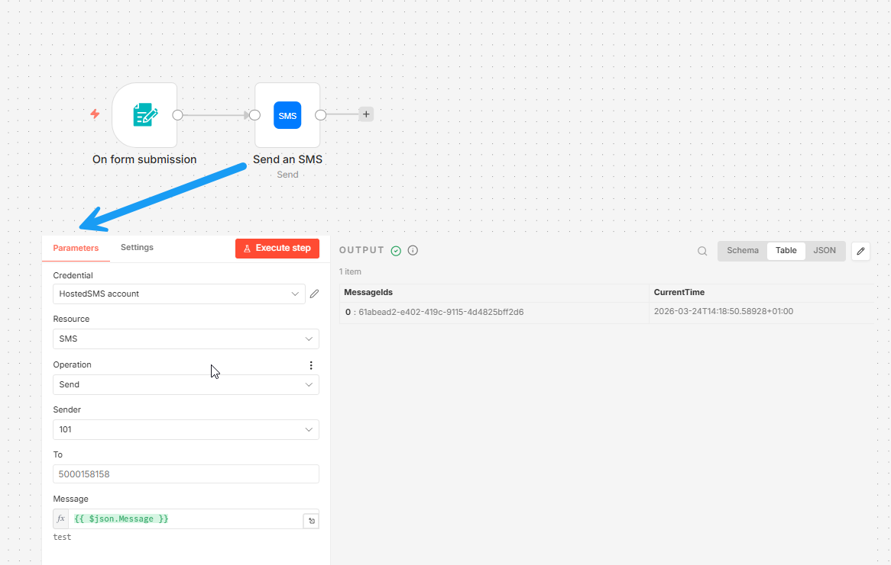
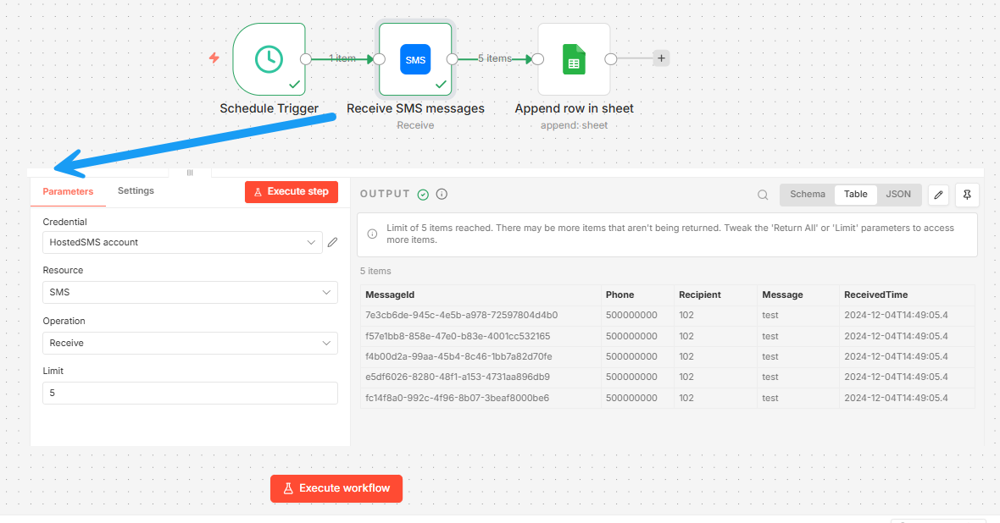

# n8n-nodes-hostedsms

This is an n8n community node. It lets you send and receive SMS messages using [hostedsms.pl](https://hostedsms.pl/).

[n8n](https://n8n.io/) is a [fair-code licensed](https://docs.n8n.io/sustainable-use-license/) workflow automation platform.

[Installation](#installation)
[Operations](#operations)
[Credentials](#credentials)
[Compatibility](#compatibility)
[Usage](#usage)
[Resources](#resources)

## Installation

Follow the [installation guide](https://docs.n8n.io/integrations/community-nodes/installation/) in the n8n community nodes documentation.

## Operations

- **SMS**
    - Send an SMS
    - Receive SMS messages

## Credentials

To use this node, you need to provide your hostedsms.pl account credentials.

### HostedSMS API

1. Go to [hostedsms.pl](https://hostedsms.pl/) and log in to your account.
2. In the n8n credential settings for "HostedSMS API", enter your:
    - **Email**: The email address used for your hostedsms.pl account.
    - **Password**: The password for your hostedsms.pl account.

Account must be activated for API usage. You can activate it in the account settings.

Refer to the [technical documentation](https://hostedsms.pl/pl/api-sms/opis-techniczny-api/) for more information.

## Usage

Here are examples of how to use and configure the HostedSms node.

### Send an SMS

### Receive SMS messages

## Compatibility

Compatible with n8n@1.0.0 or later

## Resources

* [n8n community nodes documentation](https://docs.n8n.io/integrations/#community-nodes)
* [hostedsms.pl API documentation](https://hostedsms.pl/pl/api-sms/opis-techniczny-api/)
